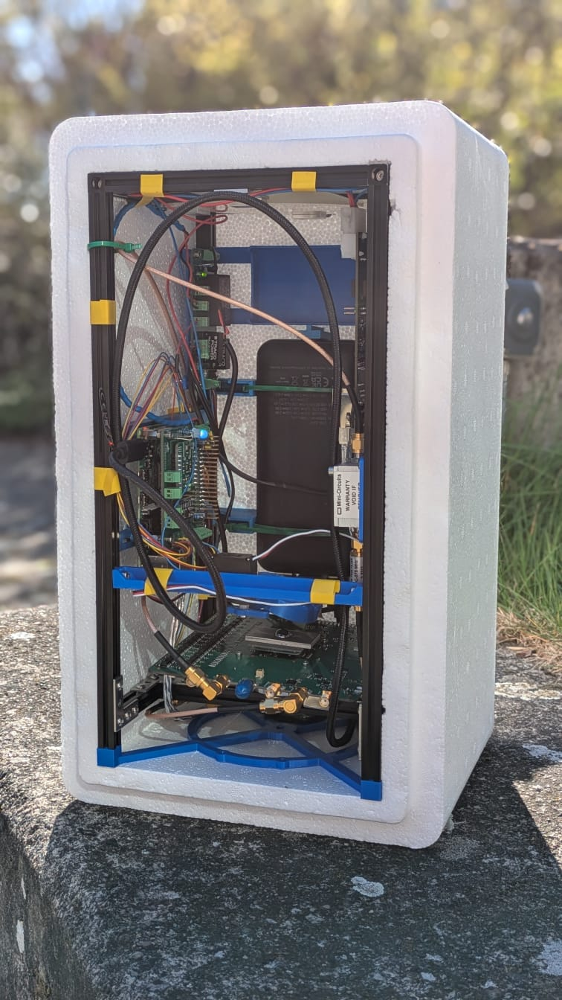

# Overview

# Structure
- `src/` python source code
- `config/` analysis settings (not implemented yet)
- `data/` telemetry and data saved during the mission
- `logs/` Event and debug logs

# Installation

# Quick start
## analysis
uv run python -m src.balloon_analysis.noise_temperature_folder_viewer --thot 300 --tcold 5 --pairs-per-average 30 --spectral-bin-size 3

# Documentation
- Data analyis -> docs/analysis.md
- Development -> docs/development.md

# Development

